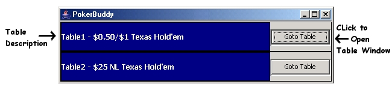
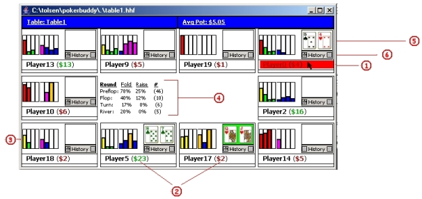
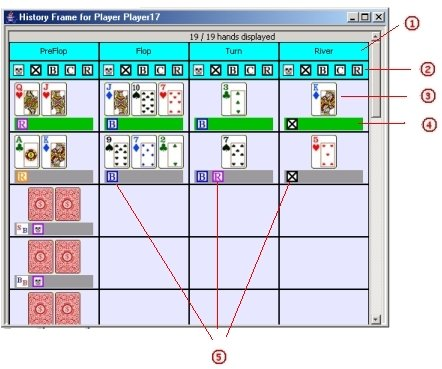

# About PokerBuddy

PokerBuddy is a data visualization application for online poker that I made in 2005. My main focus on this project was to create a tool that can by easily understood and digested by the user during play. I started this project after I saw some of the commerically available products, like PokerTracker, designed to assist online poker players. They gave the user a lot of information, but it was displayed in multiple dense tables that were not easy to read and almost impossible to consult during play. There even exist programs for sale that do nothing but format the info in PokerTracker so you can read it. Furthermore, the information was mixed without much regard to importance, so nuggets of useful data were often lost in a sea of noise. I thought I could create a more useful tool, so I started this.

NOTICE: PokerBuddy only ever supported play at PartyPoker but even that changed long ago.  It won't work with any online poker application available today and only survives in this little demo form.  

## Launching the demo

- Double-Click pokerbuddy.jar to launch PokerBuddy

You should see this interface.

The two tables shown correspond to the two .pbt files in the root directory.

- Press "Goto To Table" Button (press button for Table1 to proceed along with these instructions). It will initially be a white screen, but after a short wait you should see the screen below (w/out the annotations in red). This represents the state of the game at the termination of the history file.

- **$\color{red}{(1)}$** **Player Name:** Move mouse over the name to highlight in Red and bring up statistics labled (4).
- **$\color{red}{(2)}$** **Winnings/Losings:** The amount of $ the player has won or lost since you've been in the game,  Green = Winning.  Red = Losing
- **$\color{red}{(3)}$** **Fold/Raise statistics:** Put Mouse-Over to see text
	-- The first four bars indicate players observed fold percentage on Pre-Flop, Flop, Turn, and River. $\color{red}{Red = 75+\%}\color{yellow}{Yellow = 40-75\%}$ $\color{green}{Green = 0-40\%}$
	-- The second four bars indicate players observed raise percentage on Pre-Flop, Flop, Turn, and River. $\color{purple}{Purple = 75+%}$ $\color{orange}{Orange = 40-75%}$ $\color{blue}{Blue = 0-40%}$
- **$\color{red}{(4)}$** **Player Stats:** Mouse-Over the PlayerName to see the Players Stats in the Center Panel
- **$\color{red}{(5)}$** **Quick Pocket History:** Displays the Pocket Cards the player has been observed playing.
	-- Initially Blank if the player was not in the last showdown.  Otherwise, initially shows pockets observed during the previous hand.
- **$\color{red}{(6)}$** **History Buttons:**  Use to quickly see previous observed pocket. Backward and forward movement possible.  Buttons will be greyed out if movement in that direction is not possible.  

- *Double Click "Quick Pocket History"* ($\color{red}{(5)}$ above) to bring up the Player History Window shown below

